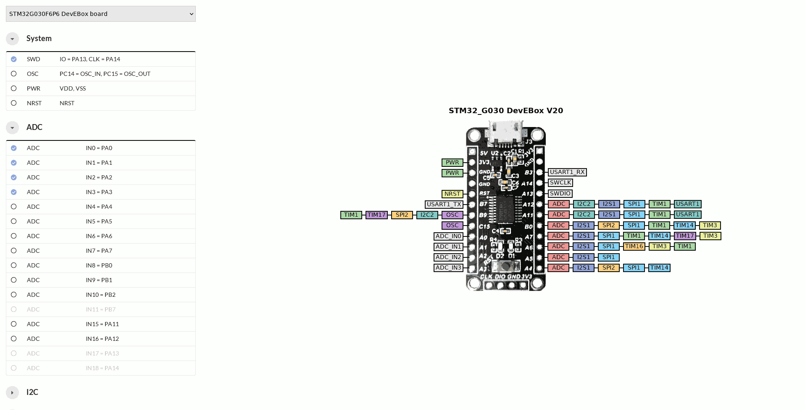

# Safe Pin Usage

Track alternate pins function for STM32G030F6P6 development board to avoid pin collisions.

### License

Source code is primarily distributed under the terms of the MIT license. See LICENSE for details.
